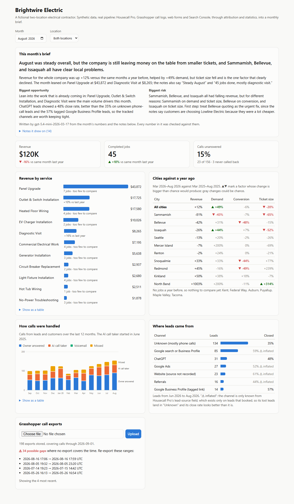
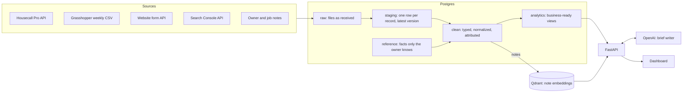

# Local Business Intelligence Engine

A small electrical contractor's data lives in four systems that don't talk
to each other: a CRM, a phone system, a website form, and Google. This
project lands all four in Postgres, works out which phone calls were new
customers and which weren't, finds what's growing and what's slipping and
**why**, and writes the owner a plain-English monthly brief in which every
number is checked against the data.

It runs on a synthetic company, Brightwire Electric, so no client data is
used anywhere. The data was calibrated against a real Seattle-area
electrical contractor and then shifted, and it reproduces the real systems'
formats and quirks, down to the layout of the phone system's CSV export.



## The problem

Brightwire runs two locations (an established Eastside shop and a South
Sound one that opened in March 2026) and wants three answers every month:

- **What's hot?** Which services are growing, once seasonality is set aside?
- **What's slipping, and why?** Is a city down because fewer people asked,
  fewer said yes, or the jobs got smaller? Each one has a different fix.
- **Where do customers come from?** Including the ones who just pick up the phone.

The data that answers them is spread across:

| Source | How it arrives | What makes it hard |
|---|---|---|
| **Housecall Pro** (CRM) | Paginated API JSON | No location field; $99 estimate visits marked "complete"; phone numbers typed six ways |
| **Grasshopper** (phones) | A CSV exported by hand each week | One call is several rows; outbound calls log an inbound row; exports overlap and leave gaps |
| **Website form** | WordPress plugin API | ~14% spam; double submissions; empty strings instead of nulls |
| **Google Search Console** | API, 16 months of history | Rare searches withheld, so totals exceed their rows |

Google Business Profile, often the biggest lead source for a local business,
isn't a source at all: its API needs Google's approval, which small
businesses often can't get. The project measures its effect indirectly
instead, through tagged links (see [Findings](#what-the-data-honestly-says)).

## Architecture



- **Raw first, then transform (ELT).** Every file is stored exactly as it
  arrived, keyed by its SHA-256 hash, so loading is idempotent and every clean
  table can be rebuilt from scratch. A bug in a normalizer is fixed once and
  the history is corrected by rebuilding.
- **The clean layer is rebuilt in one transaction** from SQL files: dashboards
  see the old tables or the new ones, never a half-built state. At this size a
  full rebuild takes about 20 seconds, which is simpler and safer than tracking
  changes.
- **Plain SQL throughout**: numbered migrations for the schema, `.sql` files for
  the transformations, bound parameters everywhere, no ORM.
- **Location is inferred** from the job's zip code, because the CRM doesn't
  record it, and from which phone line was dialed.

## The tricky part: which calls were new customers?

The phone system is where most customers first make contact, and it gives
the least information. Turning its export into "this was a new customer
asking about a panel upgrade" took five steps, each solving a separate
problem:

1. **Legs into calls.** Grasshopper logs *legs*: a customer calling in is an
   inbound row plus a row per forward (to the owner's cell, then the AI call
   taker if he doesn't answer). Legs are grouped back into conversations by
   phone line, timing, and leg type.
2. **Outbound calls that look inbound.** When the owner calls from the app,
   the log shows an *inbound* row from his own cell, then the real outbound
   row. Internal numbers are recognized from reference data, so the owner's
   cell never becomes "the busiest customer".
3. **Matching without a shared id.** Numbers are normalized to E.164 from six
   typed formats and matched against every number a customer ever gave,
   including a spouse's phone.
4. **Known *when*?** The naive question, "is this number in the CRM?", is
   wrong: every successful new customer is in the CRM by the time anyone
   looks. The real question is whether they were a customer **at the moment of
   the call**, so each customer gets a `first_seen_at` and every rule is
   time-aware. A known customer is then a returning lead if new work was
   booked soon after, or a job-related call if they had work open.
5. **Suppliers with no list.** Nobody keeps a list of supplier and inspector
   numbers, and they look exactly like local leads. They're recognized by
   behavior instead: they call and are called for months and never book.

### Measured against the truth

Because the data is synthetic, the generator knows what really happened, and
a grading package (kept outside the pipeline, which never sees the answers)
scores the pipeline against it. The rules were tuned on one seed, so the
honest score is on seeds they never saw:

| | Tuned on (seed 42) | Held out (seed 7) |
|---|---|---|
| Call legs grouped into the right conversations | 99.9% | 100.0% |
| **Calls classified correctly** | **98.4%** | **98.2%** |
| New-customer leads found | 100% | 100% |
| Supplier calls found, from behavior alone | 100% | 100% |
| Returning-customer leads found | 83.2% | 74.7% |
| Spam web forms caught (no false alarms) | 100% | 100% |
| Web leads' marketing channel | 0 wrong of 796 | – |

Returning-customer leads are the known limit: a past customer who calls and
never gets a quote looks exactly like one asking about old work. Call data
can't separate them, so the limit is reported here rather than tuned away.

Run it: `evaluation/evaluate_seed.sh 7` generates a company, runs the whole
pipeline into its own database, and prints the report. See
[evaluation/](evaluation/README.md).

## What the data honestly says

Building this surfaced findings that are true of real small businesses, not
just this synthetic one.

**Most month-to-month city swings are noise.** At about 40 jobs a month,
comparing one city's three months with a year earlier is mostly chance: one
city's competitor problem looked like an *improvement* because its year-ago
window happened to be bad. The analysis compares six months, splits each
city's revenue into **demand × conversion × ticket size**, and names a factor
as a reason only when its change is beyond about two standard errors. On
four generated companies it found the planted city problems 10 times out of
12, and when it missed, it reported "no clear reason" rather than a wrong one.

**The CRM's lead-source field flatters every channel it records.** The field
only exists on leads that became jobs, so a channel known only from it never
shows its lost leads: they all land in "unknown". Referrals looked like they
closed 100% of the time. The dashboard flags those rates as inflated instead
of showing them as fact. About 40% of leads have no known channel at all,
almost all of them phone calls, which is the measured cost of having no
tracking numbers.

**ChatGPT became a lead channel.** It sent almost nothing in the first year
and around a hundred leads in the last, visible only because ChatGPT tags
the links it sends.

**The AI call taker paid off.** Before it, 38–52% of lead and customer calls
went unanswered; after it, 12–19%.

**Weekly "last 7 days" exports lose calls.** Taken a week apart but later in
the day, they leave gaps no file covers. The pipeline detects them (in testing,
all 28 real gaps, plus a few false alarms where an overlap happened to be
quiet) and lists the ranges to re-export. The fix for the owner is simple: export 8 days.

**The brief's number guard checks numbers, not reasoning.** Early drafts used
only correct numbers and still got the story wrong ("revenue up on bigger
jobs" when tickets had shrunk), because field names in the facts were
ambiguous. Renaming them fixed it, and the lesson stands: what an LLM is
given to read is part of the prompt.

## The monthly brief

`GET /brief?month=2026-08` gathers the month's facts from the analyses, with
every number formatted once, and retrieves notes from Qdrant: for each
struggling city, notes from the past year searched by what the statistics
proved fell. A model (a pinned `gpt-5.4-mini` snapshot) drafts the brief
with structured output, and a guard rejects any draft containing a number
that isn't in the facts or notes. A rejected draft is retried once with the
offending numbers named; after that, a plain template brief built straight
from the facts is used. With no API key, the template is used from the start.

The wording varies from run to run; the facts behind it don't.

## Design decisions

- **Synthetic data with an answer key** instead of anonymized real data: it's
  publishable, reproducible from a seed, and, unlike real data, it makes the
  pipeline's accuracy measurable.
- **The generator simulates what happened, then renders each system's
  imperfect view of it.** The quirks the pipeline handles are the ones the
  real systems have.
- **Statistics before language.** The analysis decides what's true; the LLM
  only phrases it and connects it with notes.
- **Flag, don't delete.** Spam, duplicates, and unreliable rates are marked,
  so every filtering decision stays visible.
- **No framework on the dashboard.** Vanilla JavaScript modules behind
  nginx, charts as plain SVG, and an HTML template helper that escapes
  everything inserted, including the model's text.

## How I built this with AI

*Draft. Edit into your own words.*

I built this with Claude Code as a pair programmer, deliberately, and
with a few rules: I set the direction and made the domain calls, the AI
proposed designs and wrote code, and every change came with an explanation
I could follow line by line. I wanted to understand the code well enough to
defend every decision in it.

The parts that made it more than generic were the ones only I could supply.
I grounded the synthetic company in what I know from real client work: the
real structure of Housecall Pro data, and a real Grasshopper export, which
showed calls are logged as legs, outbound app calls appear as inbound rows,
and durations come wrapped as `="2:12"`. I knew the second phone line was a
new location and the forwarding number was Housecall Pro's AI call taker,
which became two of the analysis's strongest stories. I chose manual CSV
uploads over an API because that's how call data actually reaches a small
business, and when the plan assumed a list of supplier numbers I don't
have, we found a way to detect them from behavior instead.

The AI was fast at the volume of careful work: generators, SQL, statistics,
tests. My job was to catch where fast was wrong. Grading against the answer
key, re-reading the brief, and looking at every screenshot turned up a
generator that let customers return before their first visit, a brief that
contradicted its own facts, and analyses that were mostly noise at a
small business's scale. Several of the findings above came from those
corrections.

## Run it locally

Needs Docker and Python 3.12+.

```bash
cp .env.example .env              # add OPENAI_API_KEY for the brief and note search (optional)
docker compose up -d postgres qdrant

cd generator && pip install -r requirements.txt && python -m synthetic_data && cd ..

docker compose run --rm --no-deps api python -m app.migrations    # schema
docker compose run --rm --no-deps api python -m app.ingestion     # data/raw -> raw tables
docker compose run --rm --no-deps api python -m app.clean_layer   # raw -> clean (about 20 s)
docker compose run --rm --no-deps api python -m app.rag           # embed notes (needs the key)

docker compose up -d api web
```

- Dashboard: http://localhost:8080
- API and its docs: http://localhost:8000/docs
- Postgres is on host port 5434 (5432 inside Docker).

Tests: `cd apps/api && python -m pytest`, and the same in `evaluation/`.

## Project layout

```
generator/      the synthetic company and each system's export of it
apps/api/       FastAPI: migrations/, ingestion, clean_layer, analysis, rag, brief
apps/web/       the dashboard, served by nginx, which forwards /api to the API
evaluation/     grading against the answer key, and planted-story checks
data/           generated files (git-ignored): raw/ for the pipeline, answer_key/ for grading
```

## Status

Built: data, ingestion, attribution, analysis, retrieval, brief, dashboard,
and grading. Next: a live deployment on Fly.io with hosted Postgres and
Qdrant, with the upload and pipeline endpoints behind an admin token.
